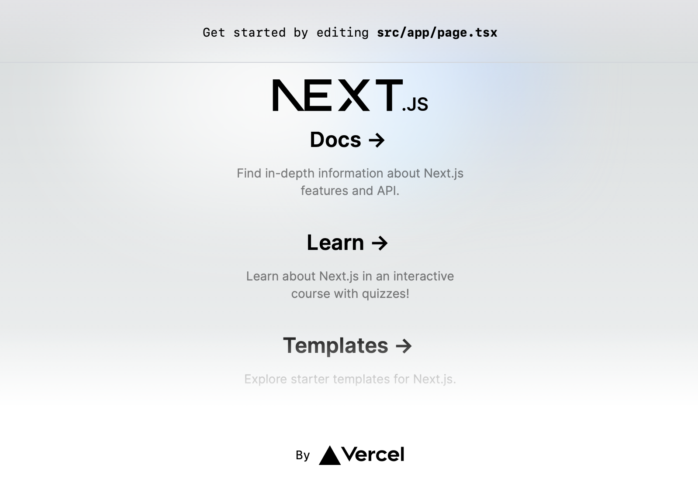
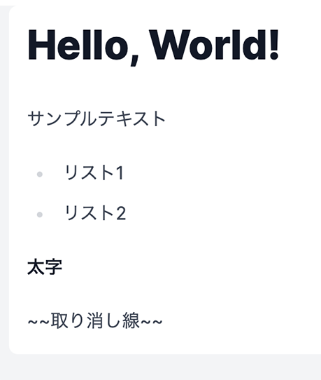

# Next.js で Markdown を使用したブログを作成

こんにちは！インプットした内容をまとめるためにブログを始めました。

Next.js、TypeScript、そしていくつかのライブラリを使って Markdown を活用したブログを作成しました。
Github Pages でホストしてカスタムドメインを割り当てています。

実際のソースコードはこちらです。
https://github.com/pochy/blog

## 使用技術

このブログは執筆時点で Next.js 14.0.3 上に App Router を用いて構築しています。最初は Pages Router にしていましたが、学習も兼ねているので新しく登場した App Router に途中で切り替えました。

- **[Next.js](https://nextjs.org/)**: このプロジェクトの基盤となるフレームワークです。Next.js の App Router を活用して、ルーティングを簡単かつ効率的に管理しています。
- **[TypeScript](https://www.typescriptlang.org/)**: JavaScript のスーパーセットとして、型安全性と開発効率の向上をもたらします。

## デザインライブラリ

デザインに関しては、以下のライブラリを採用しています：

- **[Tailwind CSS](https://tailwindcss.com/)**: 効率的なスタイリングを可能にするユーティリティファーストの CSS フレームワークです。このフレームワークを使用することで、迅速にレスポンシブなデザインを実装できます。
- **[shadcn/ui](https://ui.shadcn.com/)**: 現代的な UI コンポーネントを提供し、簡単に美しいインターフェースを構築できます。
- **[Radix UI](https://www.radix-ui.com/)**: アクセシビリティに優れた低レベルの UI コンポーネントを提供します。このライブラリはカスタマイズが容易で、デザインシステムに簡単に統合できます。

## アイコン

- **[Radix Icons](https://www.radix-ui.com/icons)**
- **[Lucide | Lucide](https://lucide.dev/)**

## 使用ライブラリについて

このプロジェクトでは、以下のライブラリを使用しています：

- **[react-markdown](https://github.com/remarkjs/react-markdown)**: Markdown を React コンポーネントに変換します。これにより、記事の内容を Markdown で簡単に記述し、動的にレンダリングできます。
- **[remark-gfm](https://github.com/remarkjs/remark-gfm)**: GitHub Flavored Markdown をサポートし、拡張機能やカスタムレンダリングを可能にします。
- **[remark-math](https://github.com/remarkjs/remark-math)** と **[rehype-katex](https://github.com/remarkjs/remark-math/tree/main/packages/rehype-katex)**: 数学的表現を Markdown 内で簡単に記述し、方程式のレンダリングに役立ちます。
- **[remark-emoji](https://github.com/rhysd/remark-emoji)**: 文章に絵文字を簡単に追加できます。
- **[remark-toc](https://github.com/remarkjs/remark-toc)**: 記事に自動的に目次を生成します。
- **[rehype-raw](https://github.com/rehypejs/rehype-raw)** と **[rehype-sanitize](https://github.com/rehypejs/rehype-sanitize)**: 生の HTML のレンダリングとサニタイズを行います。
- **[rehype-slug](https://github.com/rehypejs/rehype-slug)**: 見出しにスラッグ（URL フレンドリーな識別子）を付与します。
- **[mermaid](https://github.com/mermaid-js/mermaid)**: 複雑な図やフローチャートを Markdown で記述できます。
- **[gray-matter](https://github.com/jonschlinkert/gray-matter)**: フロントマターを解析し、メタデータを簡単に扱えます。
- **[clsx](https://github.com/lukeed/clsx)**: 条件付きでクラス名を結合し、より読みやすいコードを記述できます。
- **[feed](https://github.com/jpmonette/feed)**: RSS フィードを作成する。

### 図やフローチャート

- [Mermaid](https://mermaid.js.org/) を使用しています。

### シンタックスハイライト

- **[react-syntax-highlighter](https://github.com/react-syntax-highlighter/react-syntax-highlighter)**: コードブロックにシンタックスハイライトを適用し、記事の読みやすさを向上させます。

## プロジェクトの作成

`npx create-next-app@latest` コマンドで Next.js のプロジェクトを作成します。

コマンド実行時に質問を聞かれますが、ここでは全部 **Yes** にしています。

```bash
$ npx create-next-app@latest blog
✔ Would you like to use TypeScript? … No / Yes
✔ Would you like to use ESLint? … No / Yes
✔ Would you like to use Tailwind CSS? … No / Yes
✔ Would you like to use `src/` directory? … No / Yes
✔ Would you like to use App Router? (recommended) … No / Yes
✔ Would you like to customize the default import alias (@/*)? … No / Yes
Creating a new Next.js app in ~/blog.

Using npm.

Initializing project with template: app-tw

Installing dependencies:
- react
- react-dom
- next

Installing devDependencies:
- typescript
- @types/node
- @types/react
- @types/react-dom
- autoprefixer
- postcss
- tailwindcss
- eslint
- eslint-config-next


added 333 packages, and audited 334 packages in 13s

117 packages are looking for funding
  run `npm fund` for details

found 0 vulnerabilities
Initialized a git repository.

Success! Created blog at ~/blog
```

## 初期状態の Next.js プロジェクトの起動確認

作成されたディレクトリに移動して `npm run dev` コマンドで開発モードとして実行できます。

```bash
$ cd blog
$ npm run dev

> blog@0.1.0 dev
> next dev

   ▲ Next.js 14.0.3
   - Local:        http://localhost:3000

 ✓ Ready in 4s
```

ブラウザで `http://localhost:3000` を開くと初期状態の画面が表示されます。



## Markdown の表示

Markdown ファイルは `_posts` ディレクトリ以下に格納します。

```bash
$ mkdir -p _posts
$ touch _posts/test.md
```

```markdown:test.md
---
title: Hello, World!
createdAt: 2023-11-30T00:00:45.855
updatedAt: 2023-11-35T13:13:18.250
---

# Hello, World!

サンプルテキスト

- リスト1
- リスト2

**太字**

~~取り消し線~~
```

必要なライブラリのインストール

```bash
$ npm install react-markdown gray-matter

added 88 packages, and audited 422 packages in 6s

184 packages are looking for funding
  run `npm fund` for details

found 0 vulnerabilities
```

### Markdown ファイルの読み込みとパース

`_posts` ディレクトリ以下から Markdown ファイルを読み込んで `gray-matter` を使用してパースします。

```ts:utils/posts.ts
import fs from "fs";
import path from "path";
import matter from "gray-matter";

export type PostMeta = {
  title: string;
  createdAt: string;
  updatedAt: string;
};

export type Post = PostMeta & {
  id: string;
  filePath: string;
  content: string;
};

const postsDirectory = path.join(process.cwd(), "_posts");

export function getPostFilePaths(
  dir = postsDirectory,
  filePaths: string[] = [],
) {
  const files = fs.readdirSync(dir);

  files.forEach((file) => {
    const filePath = path.join(dir, file);
    const stat = fs.statSync(filePath);

    if (stat.isDirectory()) {
      getPostFilePaths(filePath, filePaths);
    } else if (stat.isFile() && /\.md$/.test(filePath)) {
      filePaths.push(filePath);
    }
  });

  return filePaths;
}

export function getAllPosts() {
  const postFilePaths = getPostFilePaths();
  const allPostsData = postFilePaths.map((filePath) => {
    const id = path.basename(filePath, ".md");
    const fileContents = fs.readFileSync(filePath, "utf8");
    const { data, content } = matter(fileContents);

    const post: Post = {
      id,
      filePath: filePath.replace(/\.md$/, "").replace(postsDirectory + "/", ""),
      content,
      ...(data as PostMeta),
    };
    return post;
  });
  return allPostsData;
}
```

### globals.css の変更

初期状態で入ってるスタイルは使わないため削除し、先頭 3 行の `Tailwind` の部分のみ残します。

```css:globals.css
@tailwind base;
@tailwind components;
@tailwind utilities;
```

### トップページの修正

トップページに `getAllPosts` で取得した Markdown の内容を表示します。
表示には `react-markdown` を使用します。

```tsx:app/page.tsx
import { getAllPosts } from "@/utils/posts";
import ReactMarkdown from "react-markdown";

export default function Home() {
  const posts = getAllPosts();
  return (
    <div className="bg-gray-100">
      <div className="container mt-10 pb-10 mx-auto px-0 sm:px-4 max-w-4xl">
        {posts.map((post) => (
          <div key={post.id} className="mx-auto p-4 bg-white rounded-lg">
            <ReactMarkdown>{post.content}</ReactMarkdown>
          </div>
        ))}
      </div>
    </div>
  );
}
```

ブラウザで再度トップページを確認します。
Markdown の内容が表示されている事を確認します。


### @tailwindcss/typography の適用

このままでは特にスタイルが適用されていないため、一旦 `@tailwindcss/typography` を使用します。

```bash
$ npm install @tailwindcss/typography
```

```ts:tailwind.config.ts
import type { Config } from "tailwindcss";

const config: Config = {
  content: [
    "./src/pages/**/*.{js,ts,jsx,tsx,mdx}",
    "./src/components/**/*.{js,ts,jsx,tsx,mdx}",
    "./src/app/**/*.{js,ts,jsx,tsx,mdx}",
  ],
  plugins: [require("@tailwindcss/typography")],
};
export default config;
```

```diff:app/page.tsx
- <ReactMarkdown>
+ <ReactMarkdown className="prose prose-sky mx-auto max-w-4xl">
```



スタイルが適用されました。

## その他検討したライブラリなど

- [Contentlayer](https://contentlayer.dev/)
- [Markdown Editor for React.](https://uiwjs.github.io/react-md-editor/)
- [Nextra – Next.js Static Site Generator – Nextra](https://nextra.site/)
- [Docusaurus](https://docusaurus.io/)
- [Starlight](https://starlight.astro.build/ja/)

## 参考にしたサイト

- [Next.js を利用した初めての本格的 Markdown ブログサイトの構築 | アールエフェクト](https://reffect.co.jp/react/nextjs-markdown-blog/)
- [女医が教える本当に気持ちのいい Markdown 変換処理【Next.js 編】](https://zenn.dev/yoshiishunichi/articles/667120b3d0c9d2)
- [Next.js 13 app directory で記事投稿サイトを作ってみよう](https://zenn.dev/azukiazusa/articles/next-js-app-dir-tutorial)

## まとめ

このブログの作成は Next.js と TypeScript と、Markdown に関するライブラリを使って技術的な知識を深める素晴らしい経験でした。デザインライブラリの Radix UI、Tailwind CSS、shadcn/ui の組み合わせは、とても心地よくこれからも積極的に採用していきたいと思います。

また、Markdown を活用することで、コンテンツ作成プロセスを大幅に効率化しました。
