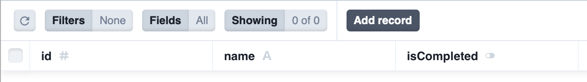

# Next.js で Server Actions を試してみる

Next.js は、サーバーサイドで実行されるアクションをサポートしています。これにより、クライアントからのリクエストに対してサーバーサイドで処理を実行し、その結果を返すことができます。

Server Actions を使用すると、データのフェッチやデータベースクエリ、外部 API へのリクエストなど、サーバーサイドでの処理を柔軟に実行することができます。これにより、パフォーマンスの向上やセキュリティの強化、クライアントサイドからの共有ロジックの実現が可能となります。

## Next.js プロジェクトを作成

```bash
$ npx create-next-app@latest nextjs-14-server-actions
✔ Would you like to use TypeScript? … No / Yes
✔ Would you like to use ESLint? … No / Yes
✔ Would you like to use Tailwind CSS? … No / Yes
✔ Would you like to use `src/` directory? … No / Yes
✔ Would you like to use App Router? (recommended) … No / Yes
✔ Would you like to customize the default import alias (@/*)? … No / Yes
Creating a new Next.js app in /Users/pochy/Learn/Next.js/nextjs-14-server-actions.

Using npm.

Initializing project with template: app-tw


Installing dependencies:
- react
- react-dom
- next

Installing devDependencies:
- typescript
- @types/node
- @types/react
- @types/react-dom
- autoprefixer
- postcss
- tailwindcss
- eslint
- eslint-config-next


added 332 packages, and audited 333 packages in 20s

116 packages are looking for funding
  run `npm fund` for details

found 0 vulnerabilities
Initialized a git repository.

Success! Created nextjs-14-server-actions at /Users/pochy/Learn/Next.js/nextjs-14-server-actions
```

インストール時点での Next.js は 14.0.3 です。

## Prisma のインストール

```bash
$ npm install prisma --save-dev

added 2 packages, and audited 335 packages in 2s

116 packages are looking for funding
  run `npm fund` for details

found 0 vulnerabilities
```

## PrismaをSQLiteデータベースと共に使用するための初期セットアップ

```bash
$ npx prisma init --datasource-provider sqlite

✔ Your Prisma schema was created at prisma/schema.prisma
  You can now open it in your favorite editor.

warn You already have a .gitignore file. Don't forget to add `.env` in it to not commit any private information.

Next steps:
1. Set the DATABASE_URL in the .env file to point to your existing database. If your database has no tables yet, read https://pris.ly/d/getting-started
2. Run prisma db pull to turn your database schema into a Prisma schema.
3. Run prisma generate to generate the Prisma Client. You can then start querying your database.

More information in our documentation:
https://pris.ly/d/getting-started
```
schema.prisma ファイルにデータモデルを定義します。以下に、単純なTodoモデルの例を示します。

```bash
// This is your Prisma schema file,
// learn more about it in the docs: https://pris.ly/d/prisma-schema

generator client {
  provider = "prisma-client-js"
}

datasource db {
  provider = "sqlite"
  url      = env("DATABASE_URL")
}

model Todo {
  id  Int @id @default(autoincrement())
  name  String
  isCompleted Boolean @default(false)
}
```

このコマンドは、Prismaのスキーマファイルに定義されたモデルと構造を、指定されたデータベースに直接適用します。主に、開発環境のデータベースに対してデータベーススキーマの変更を迅速に反映させるために使用されます。


```bash
$ npx prisma db push
Environment variables loaded from .env
Prisma schema loaded from prisma/schema.prisma
Datasource "db": SQLite database "dev.db" at "file:./dev.db"

SQLite database dev.db created at file:./dev.db

🚀  Your database is now in sync with your Prisma schema. Done in 10ms

Running generate... (Use --skip-generate to skip the generators)

added 2 packages, and audited 337 packages in 5s

116 packages are looking for funding
  run `npm fund` for details

found 0 vulnerabilities

✔ Generated Prisma Client (v5.6.0) to ./node_modules/@prisma/client in 39ms
```

## Prisma Studio からのデータベース接続

Prisma Studioは、Prismaを使用する開発者向けのGUIツールです。このツールは、Prisma Schema（schema.prisma）に基づいてデータベースのデータを視覚的に閲覧し、編集することができます。Prisma Studioは、データベースのテーブル、レコード、および関係を直感的に理解し、操作することを可能にします。

```bash
$ npx prisma studio
Environment variables loaded from .env
Prisma schema loaded from prisma/schema.prisma
Prisma Studio is up on http://localhost:5555
```


