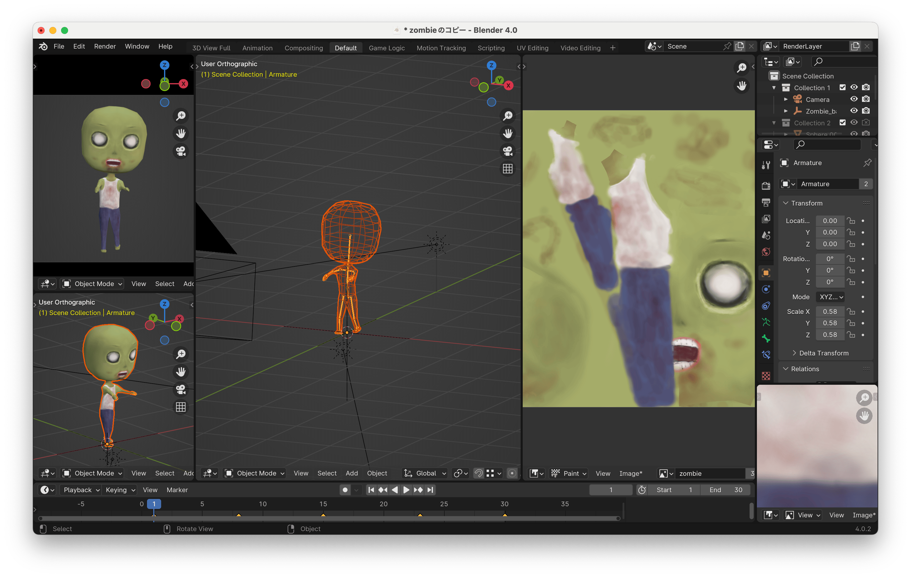
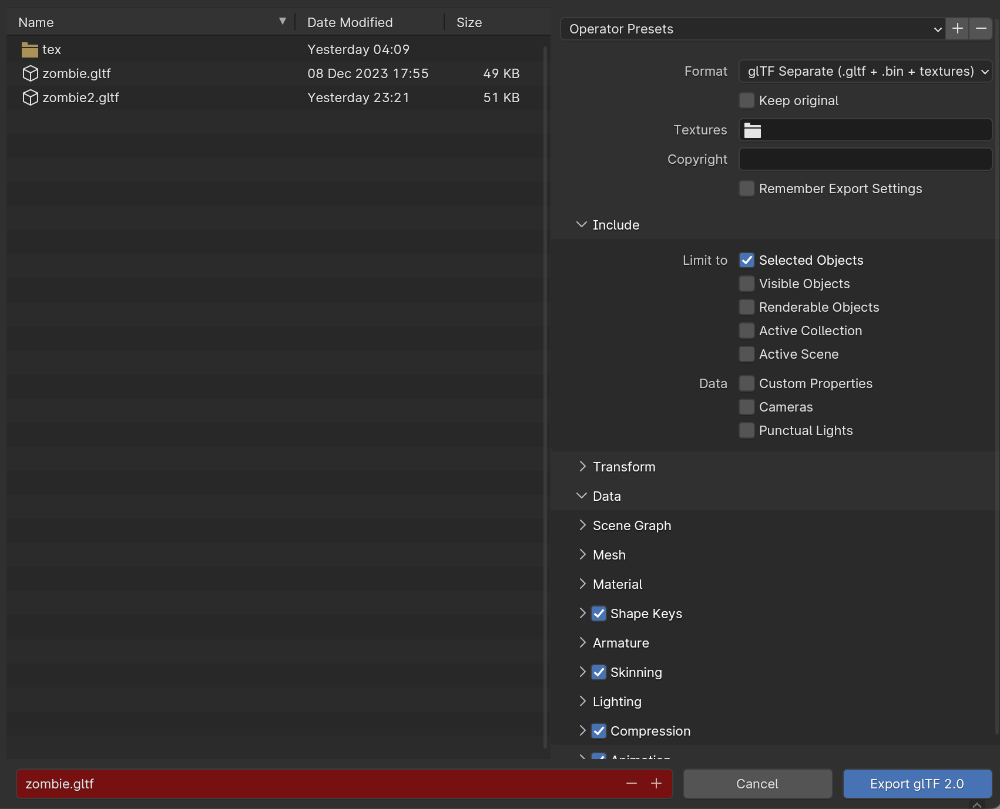
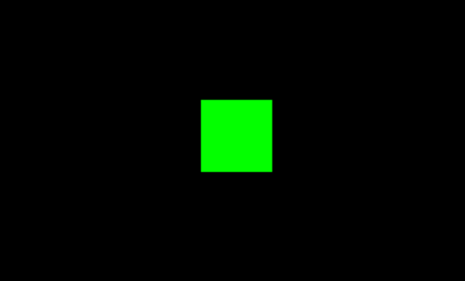
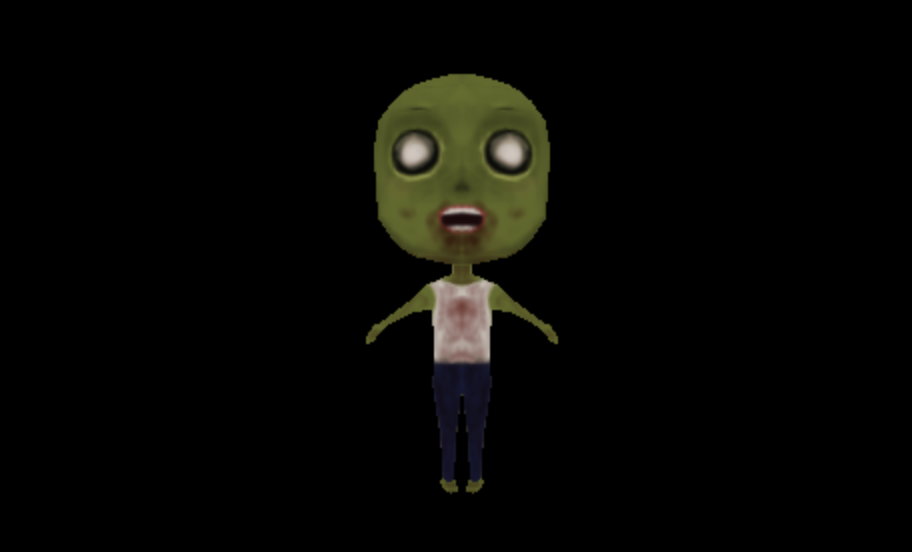

# Blender で作成した3Dモデルを Three.js で表示する

こんにちは。Three.js の勉強のためにBlenderで作成した3Dモデルを表示できるようにしました。

Three.js を基礎からちゃんと勉強するために**初めてのThree.js 第2版** という参考書も購入しました。

[O'Reilly Japan - 初めてのThree.js 第2版](https://www.oreilly.co.jp/books/9784873117706/)

また、Three.js は3Dを簡単に扱えるようにしたライブラリですが、本格的に使うなら WebGL も理解した方が良いだろうなと思ったので **初めてのWebGL 2 第2版** も購入しました。

[O'Reilly Japan - 初めてのWebGL 2 第2版](https://www.oreilly.co.jp/books/9784873119373/)

まだ最初の方と興味のあるところからつまみ読みしているので全部読めていませんが年末年始のお休みによみたいと思います。

## Three.js とは

Three.jsは、ウェブブラウザ上で3Dグラフィックスを描画するためのJavaScriptライブラリです。WebGL（Web Graphics Library）をベースにしており、WebGLの複雑な低レベルAPIを抽象化し、開発者がより簡単に3Dコンテンツを作成できるように設計されています。

## ステップ1: Blenderでモデルを作成

まずは、Blenderで3Dモデルを作成します。

今回は前に個人で Unity を使って作成していたスマホ向けタワーディフェンスゲーム（未完成）のゾンビを流用します。

タワーディフェンスゲームはまたいつか。。。



## ステップ2: モデルをエクスポート
作成したモデルは、Three.jsでサポートされているフォーマットにエクスポートする必要があります。GLTF（.gltfまたは.glb）形式が最適です。Blenderの「File」メニューから「Export」を選び、「glTF 2.0」を選択して、モデルをエクスポートしましょう。

エクスポート時に「Include」の中の「Selected Objects」にチェック、「Data」の中の「Compression」にチェックします。



## ステップ3: Three.jsのセットアップ

Three.jsライブラリのインポートをHTMLファイルに含めて、シーンを作成してカメラ、レンダラーを設定します。
そのままでは真っ黒なので一旦キューブを配置して表示します。

### シーン

Three.jsにおける「シーン」は、3Dワールドの「コンテナ」のようなもので、3Dオブジェクト、ライト、カメラなどが配置される空間です。すべての表示対象オブジェクトはこのシーンに追加します。

### カメラ

カメラは、シーンを特定の視点から見るための「目」のようなものです。位置や方向を変更することで、ユーザーが見る3Dシーンの視覚的な表現を制御します。

### レンダラー

レンダラーは、シーン内のオブジェクトとライトなどを計算し、3Dシーンを2Dの画像に変換してウェブページのCanvas要素に描画します。レンダラーはシーンとカメラの情報を受け取り、それを基に画像を生成します。このプロセスでは、オブジェクトの形状、マテリアル、ライトの影響などが計算されます。

### メッシュ

メッシュは、形状（ジオメトリ）と外観（マテリアル）を組み合わせた、3Dオブジェクトです。ジオメトリはオブジェクトの形を定義し、マテリアルはその表面の質感や色を定義します。

### マテリアル

マテリアルは、メッシュの外観（色、質感、反射率など）を定義する属性です。

### テクスチャ

テクスチャは、オブジェクトの表面に貼り付ける画像やパターンで、3Dオブジェクトの外観に深みとリアリズムを加えます。例えば、木材の質感、石の表面、壁紙のパターンなどを再現するのに使用されます。

```html
<!DOCTYPE html>
<html>
  <head>
    <meta charset="utf-8" />
    <title>three.jsでキューブを表示する</title>
    <script type="importmap">
      {
        "imports": {
          "three": "https://unpkg.com/three@v0.151.3/build/three.module.js",
          "three/addons/": "https://unpkg.com/three@v0.151.3/examples/jsm/"
        }
      }
    </script>
  </head>
  <body>
    <script type="module">
      // Three.jsライブラリのインポート
      import * as THREE from "three";

      // シーンの作成
      const scene = new THREE.Scene();

      // カメラの作成
      const camera = new THREE.PerspectiveCamera(
        75,
        window.innerWidth / window.innerHeight,
        0.1,
        1000
      );
      // カメラの位置を設定する
      camera.position.z = 5;

      // 1x1x1のサイズの立方体のジオメトリの作成
      const geometry = new THREE.BoxGeometry(1, 1, 1);
      // 緑色のマテリアルの作成
      const material = new THREE.MeshBasicMaterial({ color: 0x00ff00 });
      // ジオメトリとマテリアルを組み合わせてメッシュの作成
      const cube = new THREE.Mesh(geometry, material);
      // シーンにメッシュを追加
      scene.add(cube);

      // レンダラーの作成
      const renderer = new THREE.WebGLRenderer();
      renderer.setSize(window.innerWidth, window.innerHeight);

      // レンダラーをDOMに追加
      document.body.appendChild(renderer.domElement);

      // レンダリング
      function animate() {
        // ブラウザの描画タイミングに合わせて指定した関数を呼び出すためのWeb APIです。
        // この関数にanimateを渡すことで、次の描画タイミングで再度animate関数が呼び出され、
        // これによりアニメーションループが作成されます。
        requestAnimationFrame(animate);
        // 指定したシーンとカメラを使用してレンダリング（描画）を行います。
        renderer.render(scene, camera);
      }
      animate();
    </script>
  </body>
</html>
```



### 参考

- [インストールの方法 – three.js docs](https://threejs.org/docs/#manual/ja/introduction/Installation)
- [シーンの作成 – three.js docs](https://threejs.org/docs/#manual/ja/introduction/Creating-a-scene)

## ステップ4: 3Dモデルを読み込む
Three.jsのGLTFLoaderを使って、先ほどエクスポートしたモデルを読み込みます。読み込みが完了したら、モデルをシーンに追加し、正しい位置に配置しましょう。

また、そのままでは暗いので環境光(AmbientLight)を作成してシーンに追加します。

### GLTFLoader

- GLTF（GL Transmission Format）形式の3Dモデルを読み込むために使用されます。GLTFは、「JPEG for 3D」とも呼ばれ、3Dモデルやシーンを効率的に伝送するためのフォーマットです。
- テクスチャ、シェーダー、アニメーションなど、複雑なシーンと機能をサポートしています。

### DRACOLoader

- GoogleのDraco形式で圧縮されたメッシュデータを解凍・読み込むために使用されます。Dracoは、3Dグラフィックデータを圧縮するためのライブラリで、ファイルサイズを大幅に削減できます。
- GLTFLoaderと組み合わせて使用することで、Draco形式で圧縮されたGLTFファイルを効率的に扱うことができます。
- ネットワーク帯域の使用量を減らすことで、特に大きな3Dモデルや複雑なシーンでのパフォーマンスを向上させます。

GLTFLoaderとDRACOLoaderはよく一緒に使われます。GLTF形式の3Dモデルを効率的に読み込みつつ、Draco圧縮を使ってファイルサイズを小さく保つことで、ローディング時間を短縮し、UXを向上させることができます。特にウェブ環境では、モデルのロード時間が重要な要素となるため、この組み合わせは非常に役立ちます。

### Ambient Light

- 環境光は、シーン全体を均一に照らす光源で、特定の方向を持たず、影を作成しません。これは、リアルな影の効果が必要ない場合や、パフォーマンスを考慮して影を省略したい場合に有効です。
- 他のライトソース（点光源やスポットライトなど）と組み合わせて使用されることが多く、暗すぎる場所を明るくするのに役立ちます。

```html
<!DOCTYPE html>
<html>
  <head>
    <meta charset="utf-8" />
    <title>three.jsでゾンビを表示する</title>
    <script type="importmap">
      {
        "imports": {
          "three": "https://unpkg.com/three@v0.151.3/build/three.module.js",
          "three/addons/": "https://unpkg.com/three@v0.151.3/examples/jsm/"
        }
      }
    </script>
  </head>
  <body>
    <script type="module">
      import { GLTFLoader } from "three/addons/loaders/GLTFLoader.js";
      import { DRACOLoader } from "three/addons/loaders/DRACOLoader.js";

      // Three.jsライブラリのインポート
      import * as THREE from "three";

      // シーンの作成
      const scene = new THREE.Scene();

      // カメラの作成
      const camera = new THREE.PerspectiveCamera(
        75,
        window.innerWidth / window.innerHeight,
        0.1,
        1000
      );
      // カメラの位置を設定する
      camera.position.z = 5;

      // AmbientLightを追加する
      // 色が0xffffff（白色）で強度が1の環境光を作成しています。
      // 色は光の色をRGB形式で指定し、強度は光の強さを0から1の範囲で指定します
      const ambientLight = new THREE.AmbientLight(0xffffff, 1);
      // 作成した環境光をシーンに追加しています。
      scene.add(ambientLight);

      // GLTFLoaderのインスタンスを作成
      const loader = new GLTFLoader();
      // DRACOLoaderのインスタンスを作成
      const dracoLoader = new DRACOLoader();
      // DRACOLoaderのデコーダのパスを設定しています。
      // このパスは、3Dモデルの圧縮を解凍するためのデコーダのスクリプトが置かれているURLを指定します。
      dracoLoader.setDecoderPath(
        "https://www.gstatic.com/draco/versioned/decoders/1.4.1/"
      );
      // GLTFLoaderにDRACOLoaderを設定しています。
      // これにより、GLTFLoaderがDRACO圧縮を使用した3Dモデルを読み込む際に
      // DRACOLoaderを使用して圧縮を解凍できるようになります。
      loader.setDRACOLoader(dracoLoader);

      // 3Dモデルを読み込み
      loader.load(
        "zombie.gltf",
        // 読み込みが成功したらシーンに追加する
        function (gltf) {
          gltf.scene.position.y = -1;
          gltf.scene.position.z = 2;
          scene.add(gltf.scene);
        },
        undefined,
        // 読み込みが失敗したらエラーをコンソールに出力
        function (error) {
          console.error(error);
        }
      );

      // レンダラーの作成
      const renderer = new THREE.WebGLRenderer();
      renderer.setSize(window.innerWidth, window.innerHeight);

      // レンダラーをDOMに追加
      document.body.appendChild(renderer.domElement);

      // レンダリング
      function animate() {
        // ブラウザの描画タイミングに合わせて指定した関数を呼び出すためのWeb APIです。
        // この関数にanimateを渡すことで、次の描画タイミングで再度animate関数が呼び出され、
        // これによりアニメーションループが作成されます。
        requestAnimationFrame(animate);
        // 指定したシーンとカメラを使用してレンダリング（描画）を行います。
        renderer.render(scene, camera);
      }
      animate();
    </script>
  </body>
</html>
```


## まとめ

Blender で作成した3Dモデルを Three.js で表示する方法について記述しました。Blendr を使ったことがない場合はそこから覚えないといけないので大変ですが、自分の作ったものが表示できると感動します。

次回はBlenderでアニメーションを作成して Three.js での表示について書きたいと思います。